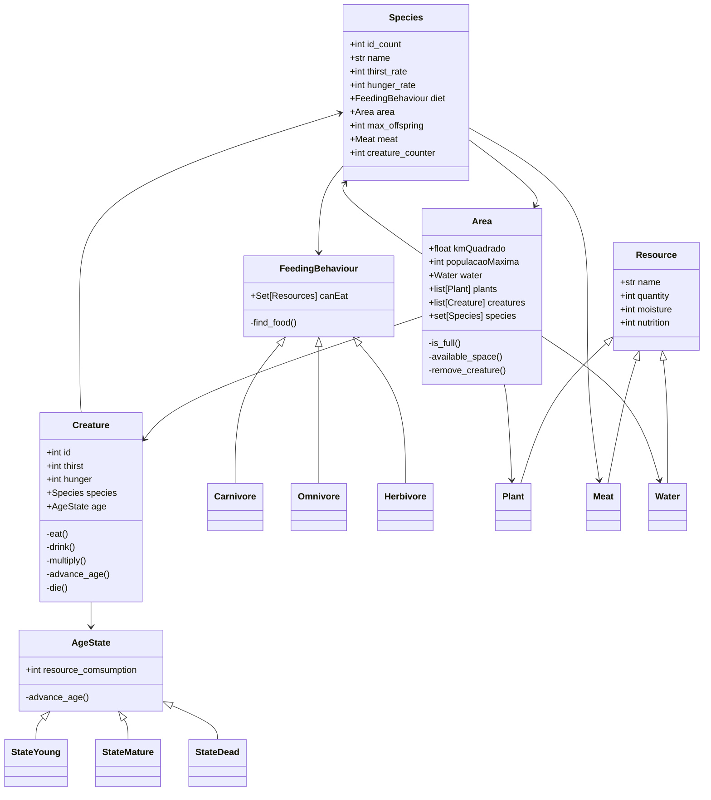

# Info

Projeto de conclusão da disciplina de tecnologia orientada a objetos.

Este programa é um simulador de ecossistema em que analisamos diversas espécies em um ambiente comum ao longo de um determinado tempo.

Este projeto tem como intuito aplicar conceitos de programação orientada a objetos e, portanto, não tem como prioridade a simulação acurada.

## Como iniciar o programa
Para iniciar o programa o usuário deve usar o comando python -m src de dentro do diretório raiz

# Diagrama

# Padrões de Projeto
Foram utilizados os seguintes padrões de projeto:
- State: Separamos a lógica da idade de uma criatura, fazendo com que dependendo do estado de vida dela (jovem, adulto, morto), suas necessidades de água e comida sejam afetados.
- Factory: Instanciamos diferentes criaturas, recursos e a propria area com uma Factory especializada.
- Flyweight: Utilizamos o padrao flyweight para agregar atributos que não são modificados em criaturas (creature_name, feeding_behaviour, area, thirst_rate, hunger_rate, max_offspring)

# Declaração de uso de IA

- utilizei ia como ferramenta de apoio
- deepseek
- finalidade:
	- analise de erros de linter: entender a diferenca entre Set e set da linguagem python
	- interpretacao de padroes de codigo: se as classes implementam corretamente os padroes desejados
	- calculos: calculos da quantidade inicial de água e população máxima por área
	- ideias para solucionar a relacao entre recurso, criatura e área (implementação própria)
		- como fazer com que fosse utilizado o mesmo objeto de recurso dentro de criatura e área? Para solucionar isto foi criado um atributo que armazena um registro dos objetos na factory de recursos
		- como conectar o comportamento alimentar com os recursos da area? Para solucionar isto foi passada a área para o feeding_behaviour
- validação: Declaro que todo o código gerado foi lido, testado e e ajustado conforme as necessidades específicas do projeto e da disciplina. A responsabilidade pela arquitetura, decisões de design e correção do código é de minha total responsabilidade.
