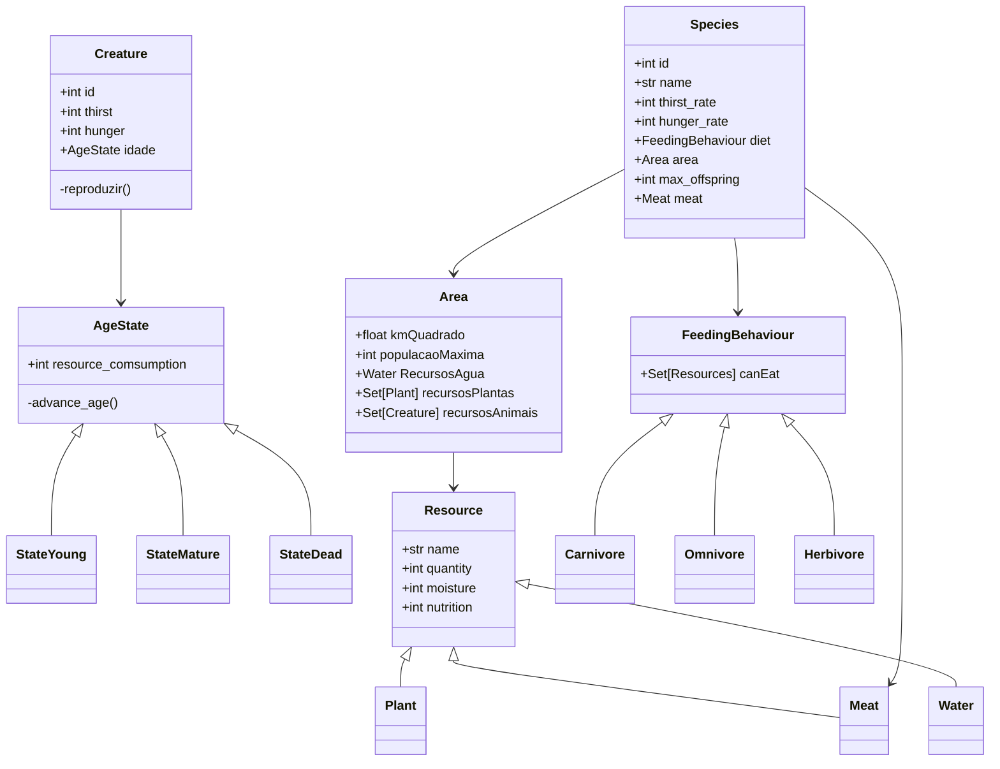

Projeto de conclusão da disciplina de tecnologia orientada a objetos.

Este programa é um simulador de ecossistema em que analisamos diversas espécies em um ambiente comum ao longo de um determinado
tempo.

Este projeto tem como intuito aplicar conceitos de programação orientada a objetos e, portanto, não tem como prioridade a simulação
acurada.

Foram utilizados os seguintes padrões de projeto:
- State: Separamos a lógica da idade de uma criatura, fazendo com que dependendo do estado de vida dela (jovem, adulto, morto), suas necessidades de água e comida sejam afetados.
- Factory: Instanciamos diferentes criaturas, recursos e a propria area com uma Factory especializada.
- Flyweight: Utilizamos o padrao flyweight para agregar atributos que não são modificados em criaturas (creature_name, feeding_behaviour, area, thirst_rate, hunger_rate, max_offspring)
